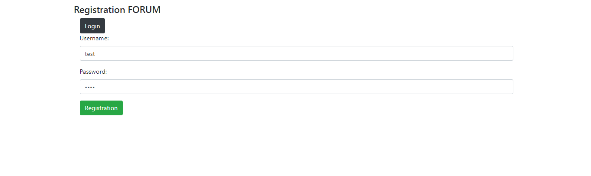
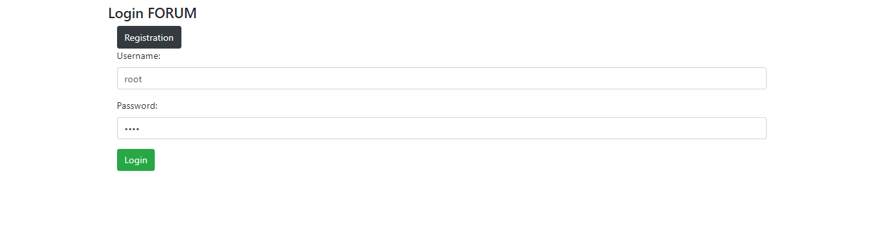
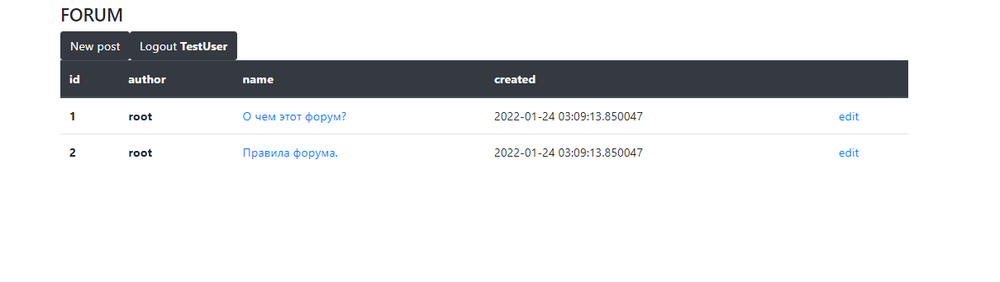
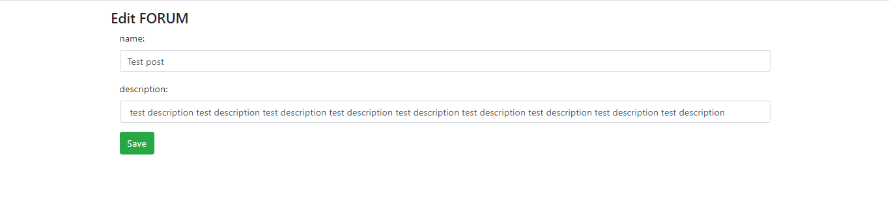
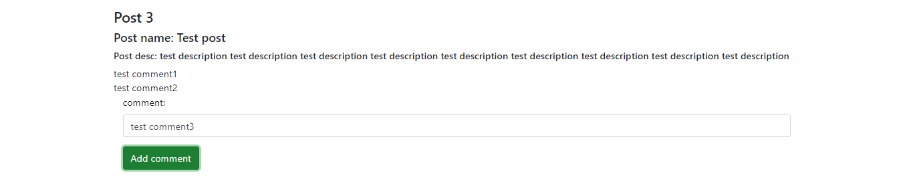
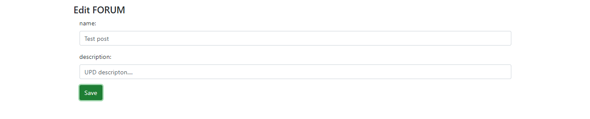

## Forum

Классическое приложение - форум. [Посмотреть на HEROKU](https://fathomless-dawn-11480.herokuapp.com/)

Использоване при разработке технологии:

- Java 11
- Spring Boot
- Spring Data JPA
- Spring Security
- Liquibase
- PostgreSQL
- Maven

***

Вначале пользователю необходимо зарегистрироваться:

Или авторизироваться, если у него уже есть учетная запись:

После авторизации пользователя встречает главная страница форума. Здесь он может посмотреть уже существующие темы, их автора и время создания или создать новую:

При создании новой темы необходимо указать её название и описание:

После того, как пост создан, в комментариях к нему можно пообщаться с другими пользователями:

Также есть возможность отредактировать уже созданную тему, изменив у неё название и описание:

